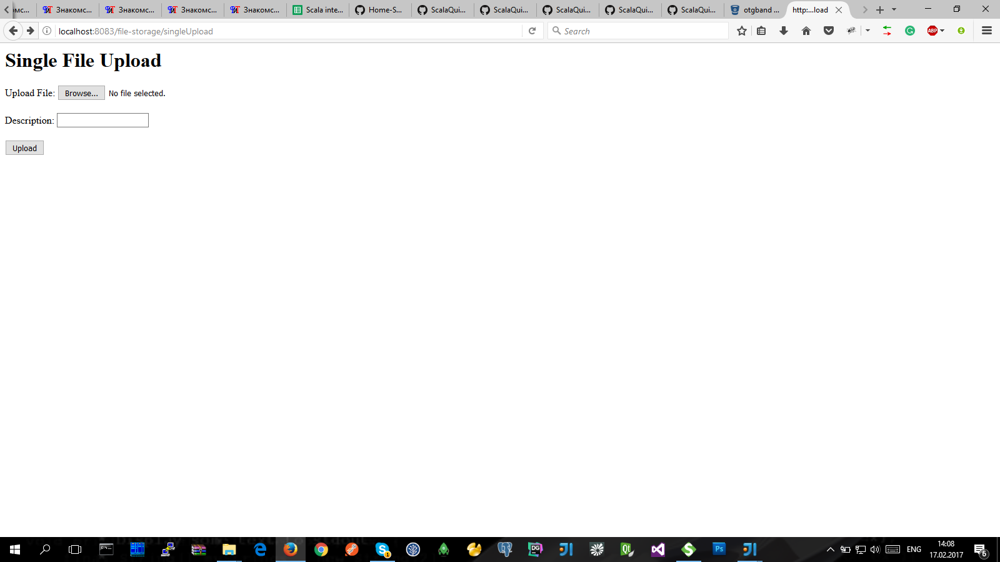
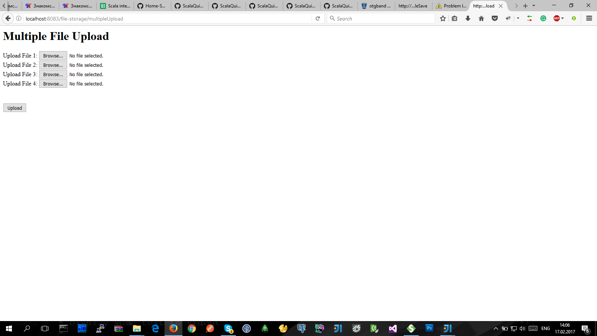
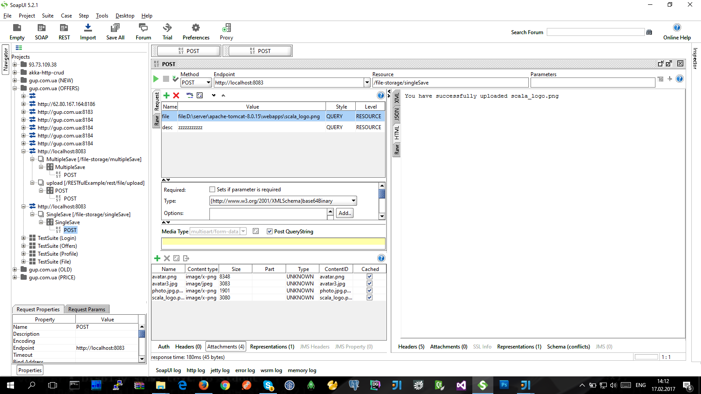
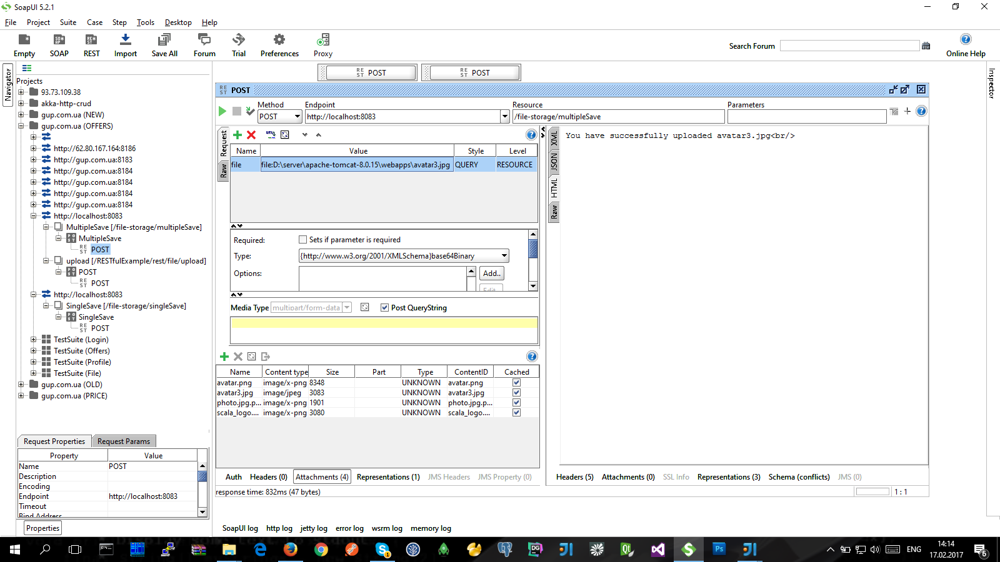

[Spring 4 MVC Single and Multiple File Upload Example with Tomcat](http://www.concretepage.com/spring-4/spring-4-mvc-single-multiple-file-upload-example-with-tomcat)
----------------------------------------------------------------
> Реализация загрузки несколких файлов (одновременно) с помощью фреймворка **Spring 4 MVC**:

- [concretepage.com/spring-4/spring-4-mvc-single-multiple-file-upload-example-with-tomcat](http://www.concretepage.com/spring-4/spring-4-mvc-single-multiple-file-upload-example-with-tomcat)
- JDK-1.7
- Maven-2.x  **(** Gradle 2.0 **)**
- Tomcat-1.8

- билд: **file-storage**  **(** file-storage.war **)**
- HTML-форма: http://localhost:8083/file-storage/singleUpload   http://localhost:8083/file-storage/multipleUpload
- REST (url): POST   http://localhost:8083/file-storage/singleSave   file=file:D:\server\apache-tomcat-8.0.15\webapps\scala_logo.png   desc=zzzzzzzzzzz
- REST (url): POST   http://localhost:8083/file-storage/multipleSave   file=file:D:\server\apache-tomcat-8.0.15\webapps\avatar3.jpg
- путь загрузки файла в: D:\server\apache-tomcat-8.0.15\photos

Working with HTTP multipart requests in soapUI
----------------------------------------------

* [charithaka.blogspot.com/2013/07/working-with-http-multipart-requests-in.html](http://charithaka.blogspot.com/2013/07/working-with-http-multipart-requests-in.html) | [stackoverflow.com/questions/4051816/how-to-test-fileupload-using-soap-ui](http://stackoverflow.com/questions/4051816/how-to-test-fileupload-using-soap-ui)

